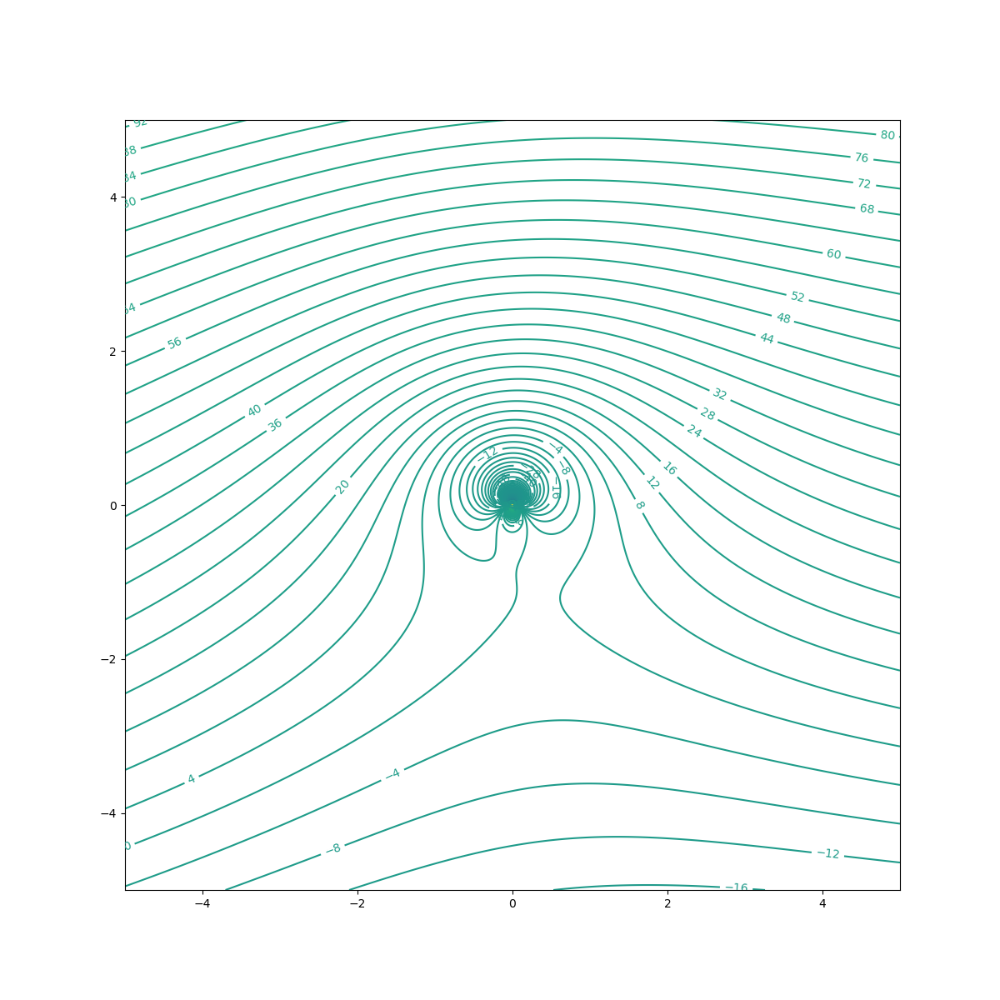
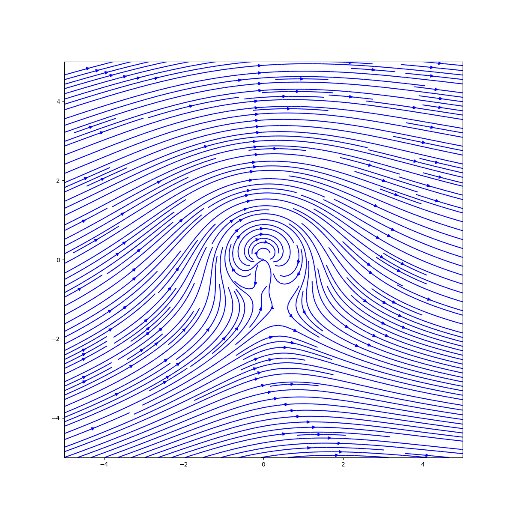

# Potential Flow Visualizer

This is a simple potential flow visualizer. The program allows you to experiment with superposition of different potential flow fields. The program is written in Python with numpy and matplotlib for visualization.

The basic elementary flows provided are:

- Uniform flow
- Source
- Sink
- Vortex
- Doublet

## Usage
These are some constants that provide a default configuration for the plotting. These can change these values as desired. The values are self-explanatory.
Ultimately, the plot function returns a matplotlib figure object. That can be further manipulated to suit your needs.
```python
import numpy as np
import elementary_flows
from flow_field import FlowField

NO_OF_POINTS = 1000
X_POS_LIMIT = 5
Y_POS_LIMIT = 5
X_NEG_LIMIT = -5
Y_NEG_LIMIT = -5

plotting_kwargs = {  # Default values
    'X_NEG_LIMIT': X_NEG_LIMIT,
    'X_POS_LIMIT': X_POS_LIMIT,
    'Y_NEG_LIMIT': Y_NEG_LIMIT,
    'Y_POS_LIMIT': Y_POS_LIMIT,
    'STREAMLINE_DENSITY': 3,
    'STREAMLINE_COLOR': 'b',
    'CONTOR_LEVELS': 500,
    'CONTOR_COLOR': 'k',
    'FIGURE_SIZE': (12, 12),
    'DPI': 100,
    "CONTOUR_LABELS": True
}
```
## Lifting Flow over a Cylinder
### Initial Configuration
```python
x = np.linspace(X_NEG_LIMIT, X_POS_LIMIT, num=NO_OF_POINTS) # X and Y coordinates for the grid
y = np.linspace(Y_NEG_LIMIT, Y_POS_LIMIT, num=NO_OF_POINTS) # Don't worry, Meshgrid is done internally

velocity = 10
radius = 1
kappa = 2 * np.pi * velocity * radius ** 2 # Known solution for a cylinder
vortex_strength = 4 * np.pi * velocity * radius # Known solution for a cylinder
alpha = np.pi/30 # Angle of attack
```

### Defining the flow field
```python
u1 = elementary_flows.UniformFlow(horizontal_vel=velocity * np.cos(alpha), vertical_vel=velocity * np.sin(alpha))
v1 = elementary_flows.Vortex(x_pos=0, y_pos=0, circulation=vortex_strength)
d1 = elementary_flows.Doublet(x_pos=0, y_pos=0, kappa=kappa)

flow = FlowField([v1, u1, d1], **plotting_kwargs)
flow.plot_flow_from_stream_function(x, y).show()
flow.plot_velocity(x, y).show()
```

## Result
### Streamline Contour Plot


### Velocity Direction Plot
