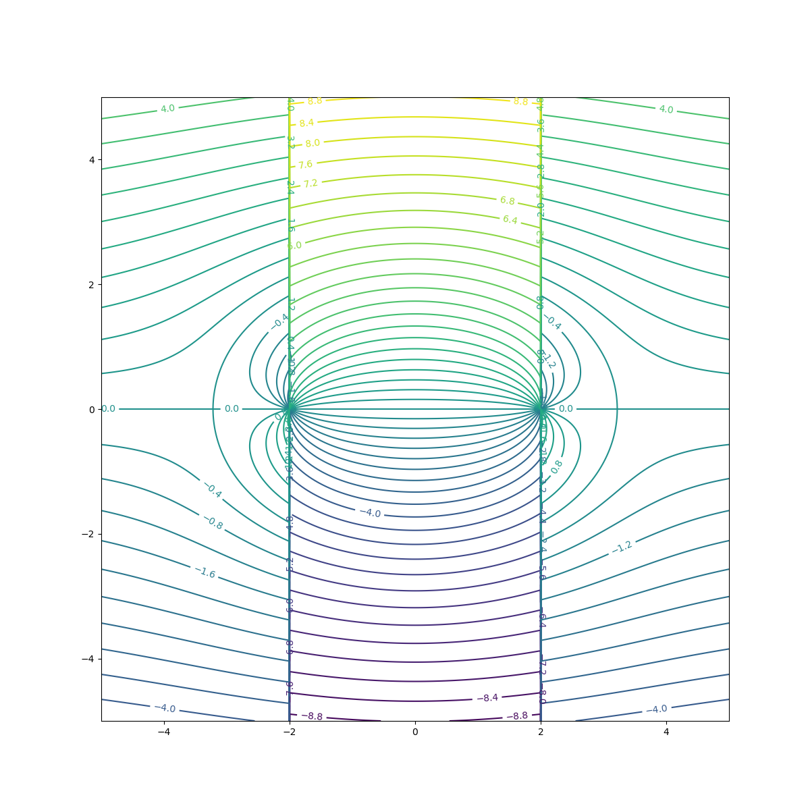
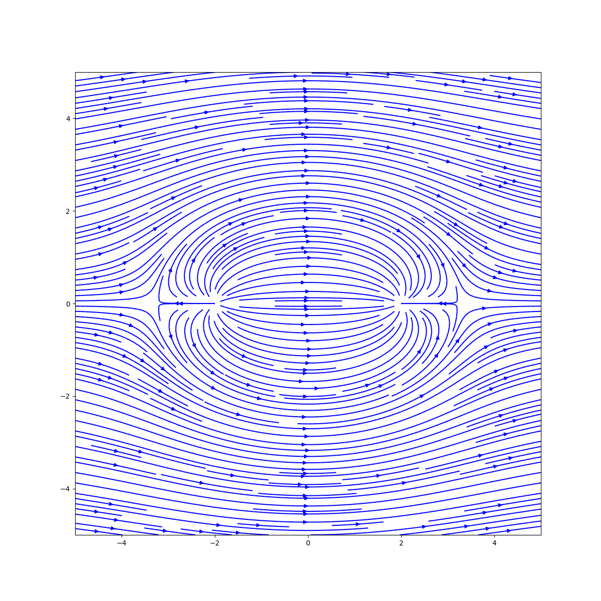
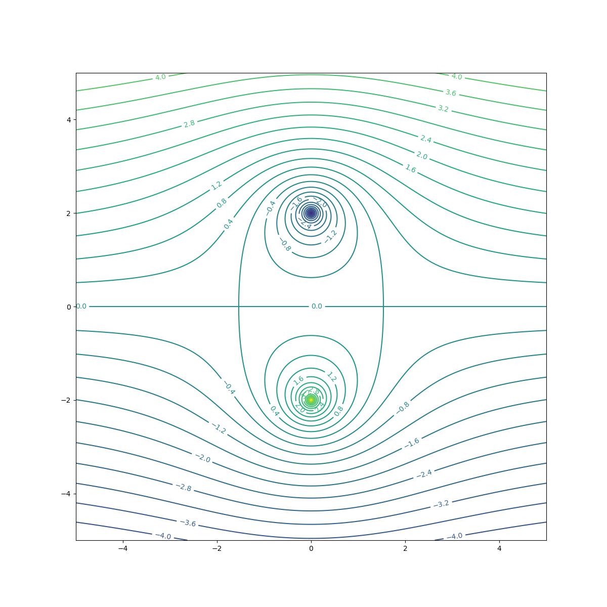
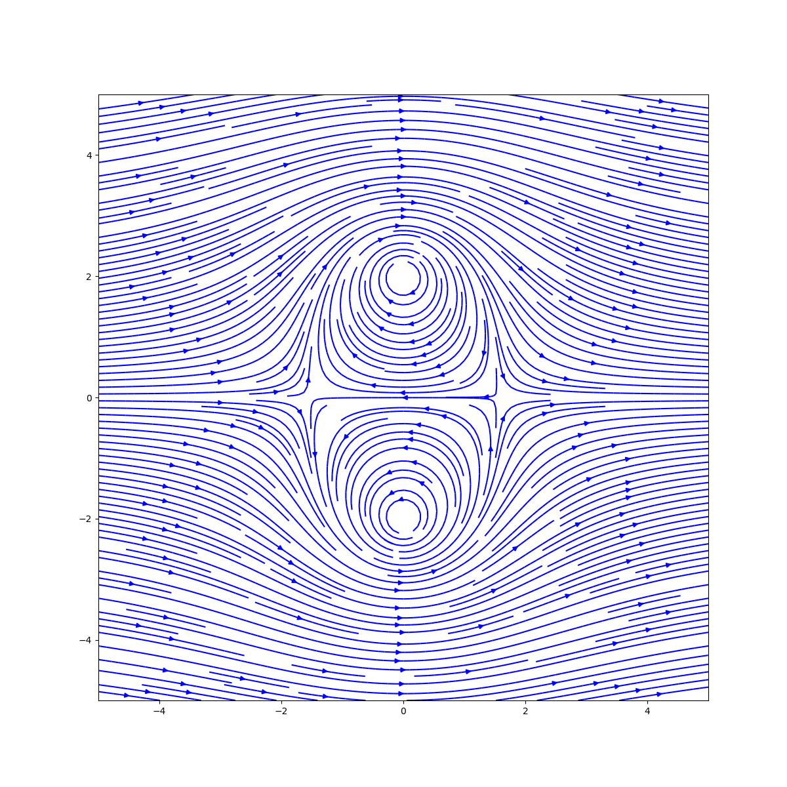

# Potential Flow Visualizer

This is a simple potential flow visualizer. The program allows you to experiment with the superposition of different potential flow fields. The program is written in Python using numpy and matplotlib for visualization.

The basic elementary flows provided are:

- Uniform flow
- Source
- Sink
- Vortex
- Doublet

## Usage
These are some constants that provide a default configuration for the plotting. These can be changed as desired. The values are self-explanatory.
Ultimately, the plot function returns a matplotlib figure object so that can be further manipulated to suit your needs.
```python
import numpy as np
import elementary_flows
from flow_field import FlowField

NO_OF_POINTS = 1000 # Number of points in the grid. More points means better resolution but slower computation
X_POS_LIMIT = 5
Y_POS_LIMIT = 5
X_NEG_LIMIT = -5
Y_NEG_LIMIT = -5

plotting_kwargs = {  # Default values
    'X_NEG_LIMIT': X_NEG_LIMIT,
    'X_POS_LIMIT': X_POS_LIMIT,
    'Y_NEG_LIMIT': Y_NEG_LIMIT,
    'Y_POS_LIMIT': Y_POS_LIMIT,
    'STREAMLINE_DENSITY': 3,
    'STREAMLINE_COLOR': 'b',
    'CONTOR_LEVELS': 500,
    'CONTOR_COLOR': 'k',
    'FIGURE_SIZE': (12, 12),
    'DPI': 100,
    "CONTOUR_LABELS": True
}
```
## Lifting Flow over a Cylinder
### Initial Configuration
```python
x = np.linspace(X_NEG_LIMIT, X_POS_LIMIT, num=NO_OF_POINTS) # X and Y coordinates for the grid
y = np.linspace(Y_NEG_LIMIT, Y_POS_LIMIT, num=NO_OF_POINTS) # Don't worry, Meshgrid is done internally

velocity = 10
radius = 1
kappa = 2 * np.pi * velocity * radius ** 2 # Known solution for a cylinder
vortex_strength = 4 * np.pi * velocity * radius # Known solution for a cylinder
alpha = np.pi/30 # Angle of attack
```

### Defining the flow field
```python
u1 = elementary_flows.UniformFlow(horizontal_vel=velocity * np.cos(alpha), vertical_vel=velocity * np.sin(alpha))
v1 = elementary_flows.Vortex(x_pos=0, y_pos=0, circulation=vortex_strength)
d1 = elementary_flows.Doublet(x_pos=0, y_pos=0, kappa=kappa)

flow = FlowField([v1, u1, d1], **plotting_kwargs)
flow.plot_flow_from_stream_function(x, y).show()
flow.plot_velocity(x, y).show()
```

### Result
### Streamline Contour Plot


### StreamPlot from Velocity


## Rankine Oval

```python
plotting_kwargs2 = {
    'CONTOR_LEVELS': 50,
}
v1 = elementary_flows.Source(x_pos=-2, y_pos=0, strength=10)
v2 = elementary_flows.Source(x_pos=2, y_pos=0, strength=-10)# Negative strength is a sink
u1 = elementary_flows.UniformFlow(horizontal_vel=1, vertical_vel=0)

flow = FlowField([v1, v2, u1], **plotting_kwargs2)
flow.plot_flow_from_stream_function(x, y).show()
flow.plot_velocity(x, y).show()
```
### Result
#### Streamline Contour Plot

Streamline Contour Plot
This is an issue I have had with sources. All streamlines eventually turn in the direction of `pi/2` or `3pi/2`. This is, I believe, because for all streamlines, as the values `x - x_0` approach zero, `theta` approaches `pi/2`. I will try to find a reasonable solution to this problem.


#### StreamPlot from Velocity
That being said, It does not affect the velocity field, so the streamplot is not affected.




## Kelvin's Oval

```python
plotting_kwargs2 = {
    'CONTOR_LEVELS': 50,
}
v1 = elementary_flows.Vortex(x_pos=0, y_pos=2, circulation=10)
v2 = elementary_flows.Vortex(x_pos=0, y_pos=-2, circulation=-10)
u1 = elementary_flows.UniformFlow(horizontal_vel=1, vertical_vel=0)
flow = FlowField([v1, v2, u1], **plotting_kwargs2)
flow.plot_flow_from_stream_function(x, y).show()
flow.plot_velocity(x, y).show()
```

### Result
#### Streamline Contour Plot

#### StreamPlot from Velocity
